# Scout QA

Scout QA is an intelligent, AI-driven web application testing platform that automates the process of testing and verifying web applications. It uses a multi-agent system to plan, execute, and troubleshoot test scenarios in real-time.

## Project Overview

The platform enables users to describe testing scenarios in natural language, and AI agents automatically execute comprehensive tests on web applications, reporting bugs and issues found.

## Key Features

- **AI-Powered Testing** - Uses Claude AI models for intelligent test planning and execution
- **Real-Time Visualization** - Watch browser automation happen in real-time
- **Multi-Agent Orchestration** - Coordinated agents for planning, testing, and troubleshooting
- **Hierarchical Tool Tracking** - Visual representation of nested tool calls and their relationships
- **Error Recovery** - Automatic troubleshooting and corrective actions
- **Browser Automation** - Supports multiple browser automation backends (Playwright MCP, Nova Act)
- **Flexible LLM Support** - Works with AWS Bedrock and OpenRouter models

## Architecture

```mermaid
graph TD
    A["User Input<br/>(Chat)"] --> B["Test Lead Agent<br/>(Planning)"]
    B --> D["Manual Tester Agent<br/>(Execution)"]
    D -->|Playwright MCP| F["AWS Bedrock<br />AgentCore Browser"]
    F -.->|"Live view<br />DCV Web Client SDK"| A
    G -->|No| H["Nova Act CLI"] -->|Troubleshoot| F
    F --> G{Completed?} -->|Yes| I["✅ Report"]
```



## Packages

### 1. Scout Agent

The backend agent system that orchestrates test execution.

**Key Components:**

- **Test Lead Agent** - Orchestrates test execution and coordinates other agents
  - Uses Claude Sonnet 4.5 (default)
  - Plans test scenarios
  - Calls Manual Tester Agent for execution
  - Calls Troubleshoot Tool for error recovery

- **Manual Tester Agent** - Executes individual test steps
  - Uses Claude Haiku 4.5 (default)
  - Executes test scenarios step-by-step
  - Retries failures once
  - Reports findings and observations

- **Tools:**
  - `executeTestScenarioTool` - Delegates test execution to Manual Tester Agent
  - `troubleshootWebappTool` - Uses Nova Act for intelligent troubleshooting

- **Browser Automation:**
  - Playwright MCP for standard browser control
  - Nova Act CLI for advanced AI-driven browser automation
  - Support for multiple browser providers (AWS AgentCore, Browserbase)

- **Infrastructure:**
  - Mastra framework for agent orchestration
  - DynamoDB or LibSQL for storage
  - Langfuse for observability

**Technology Stack:**

- Mastra
- AWS Bedrock & OpenRouter for LLMs
- Playwright MCP for browser control

### 2. Scout Webapp

The frontend web application providing user interface and real-time visualization.

**Key Components:**

- **Main Page** - Split-view layout with chat and live view
- **Chat Component** - CopilotKit integration for conversational interface
- **Tool Call Management System** - Tracks and visualizes tool execution
  - ToolCallManager - State management
  - ToolCallItem - Visual rendering
  - LiveViewIframe - Browser visualization
- **Message Rendering** - Custom message display with tool integration

**Technology Stack:**

- Next.js
- CopilotKit
- Tailwind CSS

## Getting Started

### Prerequisites

- Node.js 20+
- AWS credentials (for Bedrock) or OpenRouter API key
- Python 3.11+ (for Nova Act CLI)

### Development

```bash
corepack enable
pnpm install
pnpm dev
```

Use webapp at http://localhost:3000

## Environment Configuration

Key environment variables:

```bash
# Required
MASTRA_DYNAMODB_TABLE_NAME=
NOVA_ACT_API_KEY=

# Observability (recommended)
LANGFUSE_PUBLIC_KEY=pk-lf-
LANGFUSE_SECRET_KEY=sk-lf-
SCOUTQA_LOG_LEVEL=debug

# LLM (optional, default values below)
OPENROUTER_API_KEY=
SCOUTQA_TEST_LEAD_AGENT_MODEL=bedrock/global.anthropic.claude-sonnet-4-5-20250929-v1:0
SCOUTQA_MANUAL_TESTER_AGENT_MODEL=bedrock/global.anthropic.claude-haiku-4-5-20251001-v1:0

# Browserbase (optional, use AWS Bedrock AgentCore Browser by default)
BROWSERBASE_API_KEY=your_api_key
BROWSERBASE_PROJECT_ID=your_project_id
BROWSERBASE_REGION=us-east-1
```
